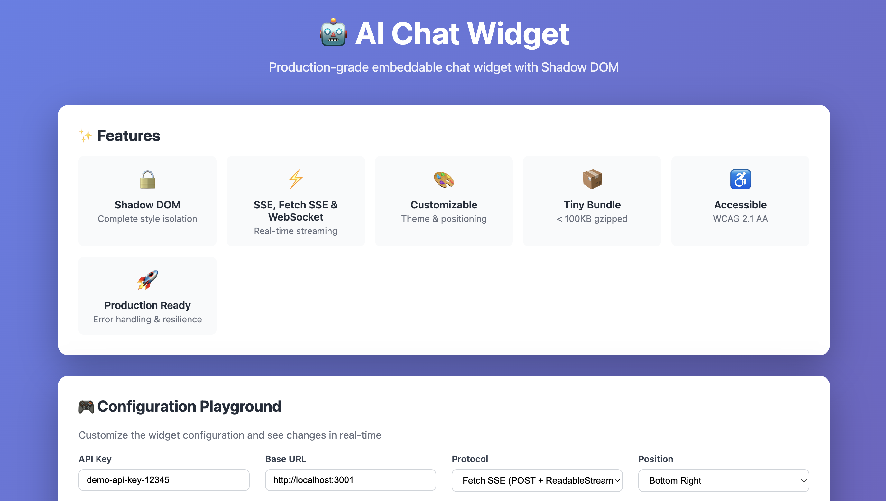
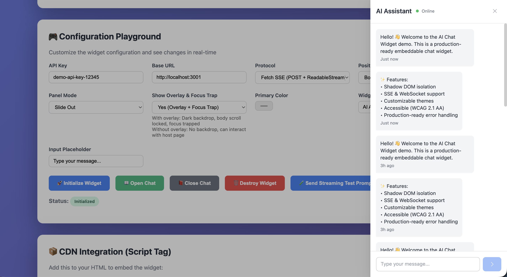
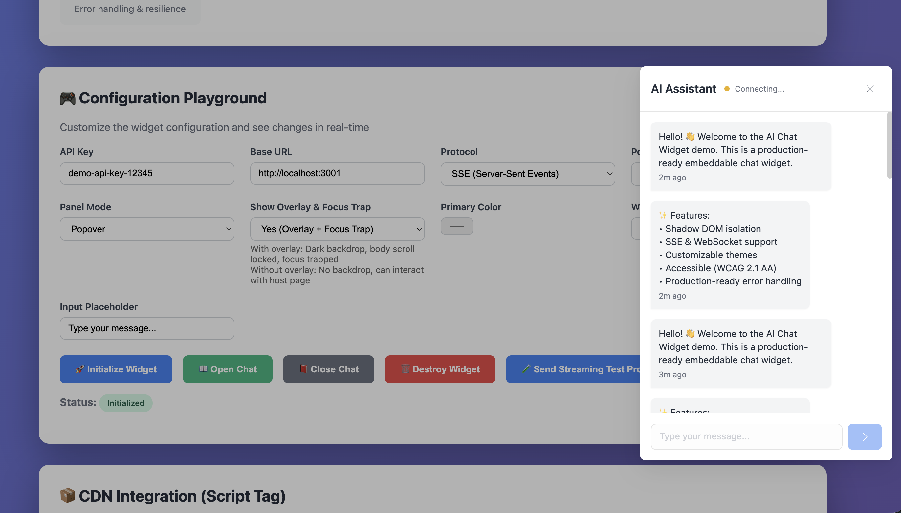

# 🤖 AI Chat Widget

[](https://www.npmjs.com/package/@srajvenkat/aichat-widget)
[](https://github.com/sraj/aichat-widget/actions/workflows/ci.yml)
[](LICENSE)

<div align="center">
  
  
  <br />
  
</div>

Production-grade embeddable chat widget built with Shadow DOM, Preact, Tailwind CSS, and Turborepo. Supports EventSource SSE, POST fetch-based SSE, and WebSocket protocols for real-time communication.

## Features

- **Shadow DOM isolation** for full style encapsulation
- **Multi-protocol** — EventSource SSE, fetch-SSE, and WebSocket
- **Customizable** themes, positioning, and panel behavior
- **Accessible** — WCAG 2.1 AA, keyboard navigation, focus management
- **TypeScript-first** packages with shared Zod validation
- **Responsive** — desktop, tablet, and mobile
- **Resilient** — reconnection with exponential backoff, error boundaries
- **Lightweight** — < 45 KB gzipped

## Install

```bash
npm install @srajvenkat/aichat-widget
# or
pnpm add @srajvenkat/aichat-widget
```

## Quick Start

```typescript
import { init } from '@srajvenkat/aichat-widget';

init({
  apiKey: 'your-api-key',
  connection: {
    protocol: 'sse',
    baseUrl: 'https://api.example.com',
  },
  theme: {
    primaryColor: '#3b82f6',
  },
  position: {
    position: 'bottom-right',
  },
});
```

```html
<!-- Or via CDN -->
<script src="https://unpkg.com/@srajvenkat/aichat-widget"></script>
<script>
  AIChatWidget.init({
    apiKey: 'your-api-key',
    connection: {
      protocol: 'fetch-sse',
      baseUrl: 'https://api.example.com',
      streamEndpoint: '/api/chat/ask/stream',
    },
  });
</script>
```

## Development

```bash
# Install dependencies
pnpm install

# Start dev server + demo
pnpm dev:all

# Run checks
pnpm lint
pnpm type-check
pnpm --filter @aichat-widget/shared test
```

## Documentation

- [Widget API](packages/widget/README.md)
- [Architecture](docs/ARCHITECTURE.md)
- [Security](docs/SECURITY.md)
- [Performance](docs/PERFORMANCE.md)

## License

MIT © [Suman Raj Venkatesan](https://github.com/sraj)
